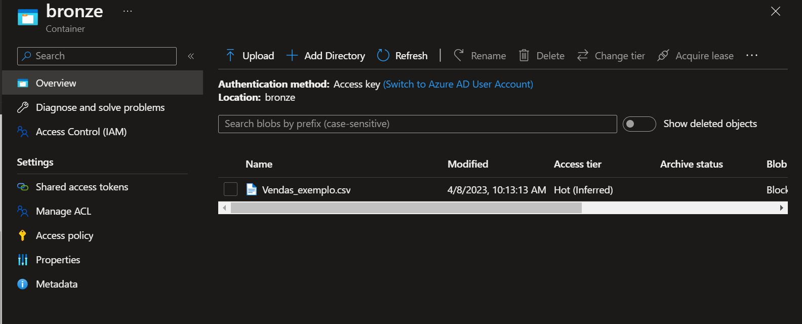
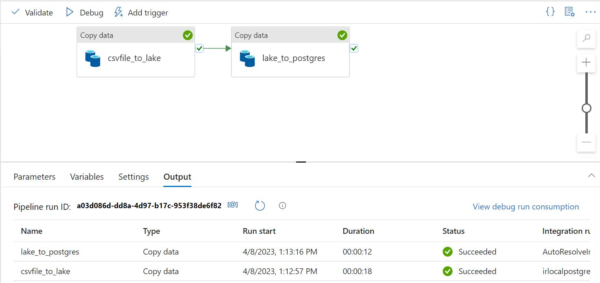
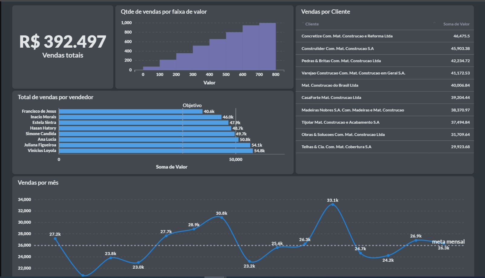
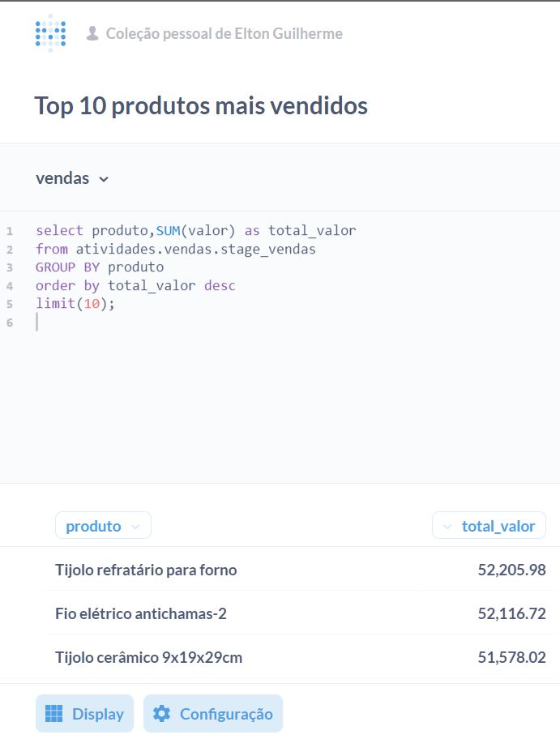

# Projeto Az 2.0 - Do arquivo on premise ao BI
### Upload de arquivo local para data lake com persistência no Postgres e dataviz no Metabase
### Parte de infra pré-configurada para o projeto:
- Azure Data Factory
- Postgres Server na Azure Cloud e PostgreSQL Database
- Linked Services
- Integration Runtime
- criação de tabela utilizando o PgAdmin
- Instalação do Metabase

## Arquivo local para datalake, base de dados e dataviz.
### Objetivo
Essa é uma pipeline na plataforma de dados Azure Data Factory, que tem como objetivo mover dados de um arquivo CSV local para uma tabela no banco de dados PostgreSQL e posterior vizualização no Metabase.

  

  
 

 

### Elaboração do arquivo-base

Foi escolhida a atividade de vendas para servir de exemplo. O arquivo de vendas foi gerado utilizando o site https://www.mockaroo.com/ que ajuda a criar bases de dados de forma rápida e permite o download em diversos formatos, podendo ainda, deixar o schema dos dados salvos.

  

  
 

 
 

  

  
 

 
 O próximo passo é realizar o upload do arquivo de modo automatizado para o data lake.
 
 ### Criação do Integration runtime
 
 Para que seja possível a comunicação entre a máquina local e a nuvem Azure, é necessário criar um Integration runtime do tipo self-hosted e instalá-lo na máquina.
 Pode ser necessário efetuar algumas configurações, para este estudo, por exemplo, foi utilizado o parâmetro: dmgcmd -DisableLocalFolderPathValidation.
 
 As orientações constam da documentação:
 
 https://learn.microsoft.com/en-us/azure/data-factory/connector-troubleshoot-file-system

 https://learn.microsoft.com/en-us/azure/data-factory/create-self-hosted-integration-runtime?tabs=data-factory#set-up-an-existing-self-hosted-ir-via-local-powershell
 
Com o linked service também configurado, podemos iniciar as atividades no pipeline do Data Factory.
 
### Atividades da pipeline - Definições

O pipeline é composto por 2 atividades:

### Primeira atividade

A primeira atividade, "csvfile_to_lake", copia o arquivo CSV local para um lake (armazenamento) no formato .CSV. Nessa atividade, é definido o source (origem) como o arquivo CSV local, utilizando a opção "DelimitedTextSource". Também é adicionada uma coluna adicional chamada "insert_data" que contém a data atual formatada em dia-mês-ano, que será usada posteriormente na tabela PostgreSQL. O sink (destino) é definido como um Azure Blob Storage com um arquivo CSV delimitado com todas as colunas citadas no arquivo original.

Vamos, primeiro, criar o servidor, a base de dados para, e os datasets, para depois, proseguirmos para a atividade 2.

### Servidor e base de dados PostgresSQL - Azure Cloud

Foi criado um servidor PostgresSQL na Azure Cloud, sendo configuradas também as opções de rede e range de IP. Optei por usar o PgAdmin para criar os scripts e vizualizar as alterações. Após conexão com o servidor na cloud, foi criada a base stage_vendas para recepcionar os dados do arquivo do data lake.

Atenção à tipagem dos dados pois o PostgresSQL têm opções tipos-texto que variam muito entre si na quantidade de caracteres permitidos.

Sobre os tipos de dados no PostgresSQL: https://www.postgresql.org/docs/15/datatype.html

Script de criação dos dados:

~~~SQL
CREATE TABLE IF NOT EXISTS vendas.stage_vendas
(
    id_venda smallint,
    n_pedido smallint,
    cond_pagto smallint,
    cod_produto smallint,
    produto text COLLATE pg_catalog."default",
    valor numeric,
    vendedor text COLLATE pg_catalog."default",
    cliente text COLLATE pg_catalog."default",
    data_venda date,
    insert_data date
)
~~~
### Datasets

O pipeline utiliza duas referências de dataset, uma para o arquivo CSV local e outra para a tabela do PostgreSQL.

### Segunda atividade

A segunda atividade, "lake_to_postgres", move os dados do lago para a tabela do PostgreSQL. Nessa atividade, é definido o source (origem) como o arquivo CSV armazenado no lake, utilizando a opção "DelimitedTextSource". O sink (destino) é definido como o banco de dados PostgreSQL, utilizando a opção "AzurePostgreSQLSink". É definido também o tamanho do lote (batch) e o tempo máximo para envio do lote. O tipo de escrita é definido como "CopyCommand".

Com os dados persistidos na base, podemos efetuar a instalação do Metabase Open source.

## Exploração e vizualização dos dados

### Instalação do Metabase OSS

*Verifique, primeiramente, se a Java Runtime Environment (JRE) já está instalada em seu sistema ela é necessária para instalação do Java JAR do Metabase.

Seguindo as orientações contidas na página https://www.metabase.com/docs/latest/installation-and-operation/running-the-metabase-jar-file na seção de instalação open source, baixe o Java JAR , crie um diretório para o arquivo baixado, e, dentro da pasta criada insira os comando abaixo no terminal como admin:

java -jar metabase.jar

Após o término do projeto, efetue os passos de login e a interface web estará disponível em http://localhost:3000/setup

Seguindo as orientações da plataforma, conecte-se com o PgAdmin e os dados da base estarão disponíveis dentro do Metabase.

### Exploração dos dados e criação do Dashboard

Podemos fazer uma exploração rápida e simples da base, elaborando perguntas e/ou elaborando querys em SQL que podem ser salvas como vizualizações e adicionadas depois a um Dashboard.

O Metabase é muito simples e prático, facilitando a exploração e vizualização dos dados.

Em resumo, o pipeline lê o arquivo CSV local, o copia para um lago e, em seguida, move os dados do lago para o banco de dados PostgreSQL. Esse pipeline poderia ser agendado para ser executado regularmente ou desencadeado por um evento específico.

